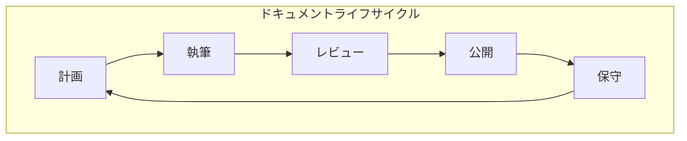

# Document Skills

最終更新日: 2025-11-02 05:15:28

## 概要

Document Skillsは、Vantage Hubプロジェクトにおけるドキュメント作成、管理、メンテナンスに関する包括的なスキルセットです。技術仕様書、APIドキュメント、ユーザーガイド、アーキテクチャ設計書など、あらゆるドキュメントの作成と管理を支援します。

## スキルカテゴリ

### 1. 仕様書作成 (Specification Writing)
- 技術仕様書
- API仕様書
- データモデル定義
- プロトコル仕様

### 2. アーキテクチャドキュメント (Architecture Documentation)
- システム設計書
- コンポーネント図
- データフロー図
- デプロイメント図

### 3. 実装ガイド (Implementation Guides)
- コーディングガイドライン
- ベストプラクティス
- トラブルシューティング
- パフォーマンス最適化

### 4. ユーザードキュメント (User Documentation)
- ユーザーガイド
- インストールガイド
- クイックスタート
- FAQ

## ドキュメント構造

```
docs/
├── specs/                    # 仕様書
│   ├── physical-event/      # Physical Event仕様
│   ├── api/                 # API仕様
│   └── protocols/           # プロトコル仕様
├── architecture/            # アーキテクチャ文書
│   ├── overview/           # 概要
│   ├── components/         # コンポーネント設計
│   └── diagrams/           # 図表
├── guides/                  # ガイド文書
│   ├── development/        # 開発ガイド
│   ├── deployment/         # デプロイメント
│   └── operations/         # 運用ガイド
└── references/             # リファレンス
    ├── api/               # APIリファレンス
    ├── cli/               # CLIリファレンス
    └── configuration/     # 設定リファレンス
```

## ドキュメント作成ガイドライン

### 1. 文書構成

#### 必須セクション
- **タイトル**: 明確で検索しやすいタイトル
- **最終更新日**: YYYY-MM-DD HH:MM:SS形式
- **概要**: 文書の目的と範囲を簡潔に説明
- **目次**: 3セクション以上の場合は必須

#### 推奨セクション
- **前提条件**: 必要な知識やツール
- **用語定義**: 専門用語の説明
- **例**: 実践的なコード例
- **関連リンク**: 参考資料へのリンク

### 2. 文体ガイド

#### 基本原則
- **明確性**: 曖昧さを避け、具体的に記述
- **一貫性**: 用語や表記を統一
- **簡潔性**: 冗長な表現を避ける
- **実用性**: 実践的な情報を提供

#### 表記規則
- 日本語と英語の混在時は半角スペースで区切る
- コード、ファイル名、コマンドは`バッククォート`で囲む
- 強調は**太字**、注意事項は*斜体*を使用
- リストは箇条書きを積極的に活用

### 3. 図表作成

#### Mermaidダイアグラム


#### フローチャート規則
- 開始/終了: 楕円
- プロセス: 長方形
- 判断: ひし形
- データ: 平行四辺形

### 4. コード例

#### インラインコード
`const eventBus = new EventBus()`のように記述

#### ブロックコード
```rust
// 言語を明示
pub struct PhysicalEvent {
    pub id: Uuid,
    pub timestamp: DateTime<Utc>,
    pub event_type: EventType,
}
```

## 仕様書テンプレート

### 技術仕様書テンプレート

```markdown
# [機能名] 技術仕様書

最終更新日: YYYY-MM-DD HH:MM:SS

## 1. 概要

### 1.1 目的
[この仕様の目的を記述]

### 1.2 スコープ
[仕様の範囲を明確に定義]

### 1.3 用語定義
| 用語 | 定義 |
|------|------|
| [用語1] | [定義1] |
| [用語2] | [定義2] |

## 2. 機能要件

### 2.1 機能概要
[機能の全体像を説明]

### 2.2 詳細仕様
[具体的な動作や振る舞いを記述]

## 3. 技術設計

### 3.1 アーキテクチャ
[システム構成図を含める]

### 3.2 データモデル
[データ構造やスキーマを定義]

### 3.3 API設計
[インターフェース仕様を記述]

## 4. 非機能要件

### 4.1 パフォーマンス
[性能要件を定量的に記述]

### 4.2 セキュリティ
[セキュリティ要件と対策]

### 4.3 可用性
[可用性要件とSLA]

## 5. 実装ガイド

### 5.1 開発環境
[必要なツールや設定]

### 5.2 実装例
[サンプルコードを提供]

## 6. テスト計画

### 6.1 単体テスト
[テスト項目と期待結果]

### 6.2 統合テスト
[システム間の連携テスト]

## 7. 参考資料
- [リンク1]
- [リンク2]
```

## Physical Event仕様書

Physical Event Systemの詳細仕様は[こちら](../../../specs/physical-event/)を参照してください。

### 主要コンポーネント
1. **Event Manager**: イベントの中央管理
2. **Event Bus**: 非同期メッセージ配信
3. **Event Source**: デバイス監視とイベント生成
4. **Event Handler**: イベント処理ロジック
5. **Event Filter**: イベントフィルタリング

### サポートするイベントタイプ
- GPIO状態変化
- USB機器接続/切断
- シリアルデータ受信
- ネットワークデバイス検出
- カスタムイベント

## ベストプラクティス

### 1. バージョン管理
- すべてのドキュメントはGitで管理
- 重要な変更には意味のあるコミットメッセージ
- ドキュメントの変更履歴を維持

### 2. レビュープロセス
- 技術的正確性の確認
- 読みやすさの改善
- 例やコードの動作確認
- リンクの有効性チェック

### 3. メンテナンス
- 定期的な内容の見直し（四半期ごと）
- 破損リンクの修正
- 古い情報の更新または削除
- フィードバックの反映

### 4. アクセシビリティ
- 見出しの階層を適切に使用
- 画像には代替テキストを提供
- 色だけに依存しない情報伝達
- モバイルでも読みやすい構成

## ツールとリソース

### ドキュメント生成ツール
- **rustdoc**: Rustコードからのドキュメント生成
- **mdBook**: Markdownベースの書籍形式ドキュメント
- **Docusaurus**: 静的サイトジェネレータ
- **MkDocs**: Pythonベースのドキュメントビルダー

### 図表作成ツール
- **Mermaid**: テキストベースの図表生成
- **draw.io**: ブラウザベースの図表エディタ
- **PlantUML**: UML図の生成
- **Excalidraw**: 手書き風の図表作成

### 品質チェックツール
- **markdownlint**: Markdownの構文チェック
- **textlint**: 日本語の文章校正
- **linkcheck**: リンク切れの検出
- **Vale**: スタイルガイドの適用

## 貢献ガイドライン

### ドキュメントの追加
1. 適切なディレクトリに配置
2. テンプレートに従って作成
3. レビューのためのPRを作成
4. フィードバックに基づいて修正

### 既存ドキュメントの更新
1. 最新の情報を反映
2. 更新日時を変更
3. 変更内容を明確に記述
4. 必要に応じて関連文書も更新

### 翻訳
1. 原文の意味を正確に伝える
2. 対象読者に適した表現を使用
3. 技術用語は統一された訳語を使用
4. 翻訳元のバージョンを記録

## 参考資料

### スタイルガイド
- [Google Developer Documentation Style Guide](https://developers.google.com/style)
- [Microsoft Writing Style Guide](https://docs.microsoft.com/en-us/style-guide/welcome/)
- [The Rust Programming Language Style Guide](https://doc.rust-lang.org/nightly/style-guide/)

### ドキュメント作成のリソース
- [Write the Docs](https://www.writethedocs.org/)
- [Documentation System](https://documentation.divio.com/)
- [Technical Writing Courses](https://developers.google.com/tech-writing)

### 関連プロジェクト
- [Vantage Hub メインドキュメント](../../)
- [Physical Event 仕様](../../../specs/physical-event/)
- [API リファレンス](../../../references/api/)