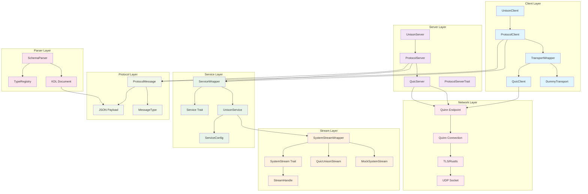
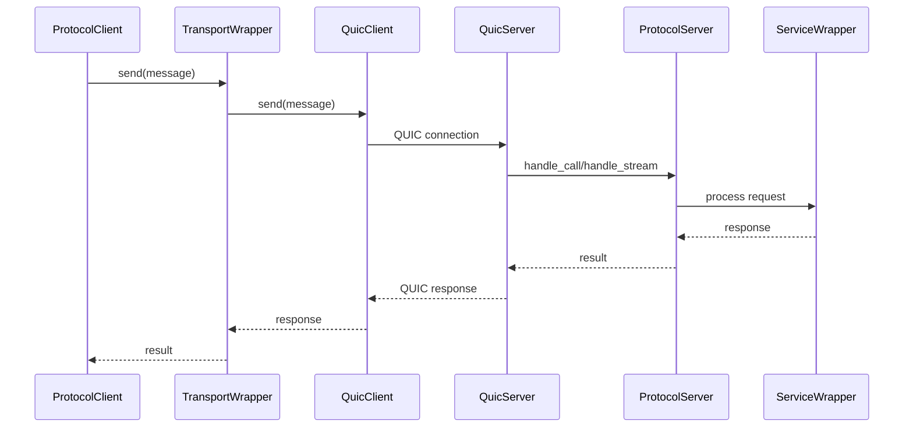
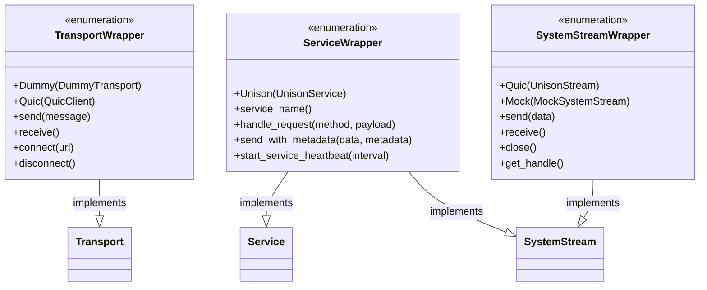
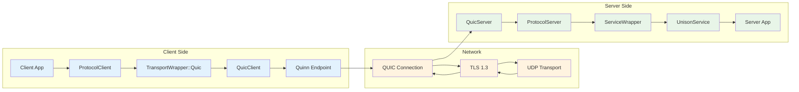
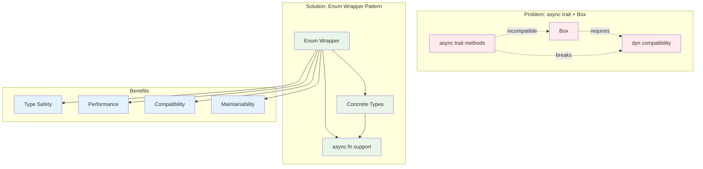
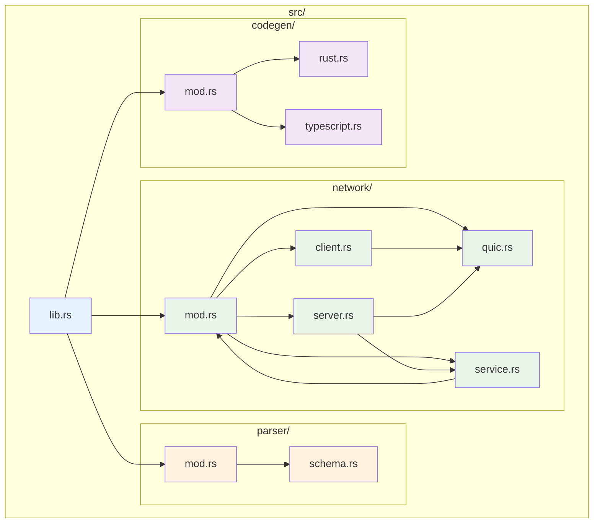

# Unison Protocol アーキテクチャ

## システム全体構成

## データフロー

## Enum Wrapper パターン

## QUIC通信アーキテクチャ

## 非同期処理とdyn互換性

## モジュール依存関係

## 主要コンポーネント詳細

### ProtocolClient
- **役割**: クライアント側エントリーポイント
- **機能**: 
  - Transport管理 (QUIC/Dummy)
  - Service登録・管理
  - RPC呼び出し (call/stream)
- **依存**: TransportWrapper, ServiceWrapper

### ProtocolServer  
- **役割**: サーバー側エントリーポイント
- **機能**:
  - ハンドラー登録 (call/stream/unison)
  - Service管理
  - QUIC接続処理
- **依存**: QuicServer, ServiceWrapper

### QuicServer
- **役割**: QUIC通信サーバー
- **機能**:
  - Quinn Endpoint管理
  - TLS証明書自動ロード
  - 接続受付・処理
- **依存**: Quinn, Rustls

### ServiceWrapper
- **役割**: Service trait dyn互換性解決
- **機能**:
  - Service trait完全実装  
  - SystemStream trait実装
  - UnisonService ラッピング
- **依存**: UnisonService

### SystemStreamWrapper
- **役割**: SystemStream trait dyn互換性解決
- **機能**:
  - 双方向ストリーム抽象化
  - Mock/QUIC実装切り替え
  - ストリームハンドル管理
- **依存**: MockSystemStream, QuicUnisonStream

### TransportWrapper  
- **役割**: Transport trait dyn互換性解決
- **機能**:
  - Dummy/QUIC転送実装
  - 接続管理
  - メッセージ送受信
- **依存**: DummyTransport, QuicClient

## 設計原則

1. **型安全性**: Enum wrapperによる静的型チェック
2. **パフォーマンス**: Box<dyn>オーバーヘッドなし
3. **拡張性**: 新しい実装の追加容易
4. **互換性**: async fn ネイティブサポート
5. **保守性**: 明確な責任分離とモジュール構造