# spec/01: Unison Protocol - コアネットワーク仕様

**バージョン**: 0.1.0-draft  
**最終更新**: 2025-11-05  
**ステータス**: Draft

---

## 目次

1. [概要](#1-概要)
2. [設計思想](#2-設計思想)
3. [ネットワークアーキテクチャ](#3-ネットワークアーキテクチャ)
4. [起動シーケンス](#4-起動シーケンス)
5. [ディスカバリー機構](#5-ディスカバリー機構)
6. [Network IDとアドレッシング](#6-network-idとアドレッシング)
7. [QUIC通信](#7-quic通信)
8. [パケットフォーマット](#8-パケットフォーマット)
9. [障害時の動作](#9-障害時の動作)
10. [セキュリティ](#10-セキュリティ)
11. [今後の拡張](#11-今後の拡張)
12. [関連ドキュメント](#12-関連ドキュメント)

---

## 1. 概要

Unisonプロトコルは、**スケーラブルで高性能な分散ネットワーク**を実現するため、3層アーキテクチャとQUICトランスポートを採用しています。

### 1.1 主要な特徴

- **3層アーキテクチャ**: Agent/Hub/Root構造によるスケーラブルな設計
- **QUICトランスポート**: 超低遅延・高スループットの通信
- **自律分散**: Hub無しでも動作可能
- **プライベートネットワーク**: 独自のIPv6アドレス空間

### 1.2 システム全体像

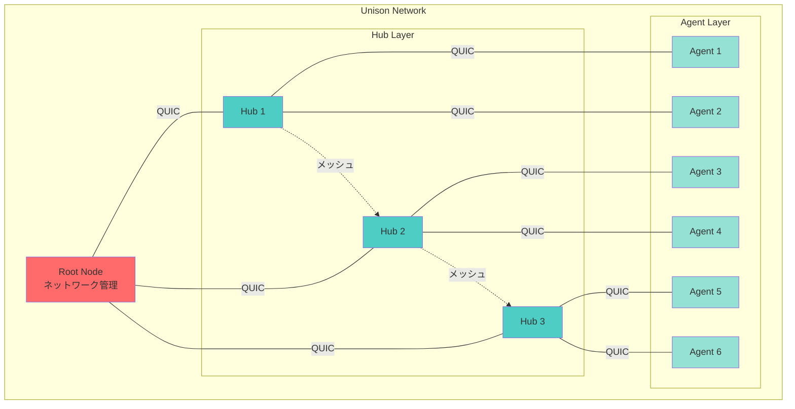
```mermaid
graph TB
    subgraph "Unison Network"
        Root[Root Node<br/>ネットワーク管理]
        
        subgraph "Hub Layer"
            Hub1[Hub 1]
            Hub2[Hub 2]
            Hub3[Hub 3]
        end
        
        subgraph "Agent Layer"
            A1[Agent 1]
            A2[Agent 2]
            A3[Agent 3]
            A4[Agent 4]
            A5[Agent 5]
            A6[Agent 6]
        end
        
        Root ---|QUIC| Hub1
        Root ---|QUIC| Hub2
        Root ---|QUIC| Hub3
        
        Hub1 -.メッシュ.-> Hub2
        Hub2 -.メッシュ.-> Hub3
        
        Hub1 ---|QUIC| A1
        Hub1 ---|QUIC| A2
        Hub2 ---|QUIC| A3
        Hub2 ---|QUIC| A4
        Hub3 ---|QUIC| A5
        Hub3 ---|QUIC| A6
    end
    
    style Root fill:#ff6b6b
    style Hub1 fill:#4ecdc4
    style Hub2 fill:#4ecdc4
    style Hub3 fill:#4ecdc4
    style A1 fill:#95e1d3
    style A2 fill:#95e1d3
    style A3 fill:#95e1d3
    style A4 fill:#95e1d3
    style A5 fill:#95e1d3
    style A6 fill:#95e1d3
```

### 1.3 読者対象

- Unisonプロトコルの実装者
- ネットワークアーキテクチャを理解したい開発者
- システム設計の意思決定者

---

## 2. 設計思想

### 2.1 設計目標

| 目標 | 説明 |
|------|------|
| **最高速ネットワーク** | QUICの特性を最大限に活用 |
| **スケーラビリティ** | 数千〜数万のノードをサポート |
| **柔軟性** | Hub無しでも動作可能な自律分散型 |
| **プライバシー** | 独自のIPv6ユーザネットワーク |

### 2.2 なぜQUICを採用したか

QUICを採用した最大の理由は、**単一のコネクションで複数の通信パターンを効率的に実現できる**ことです。

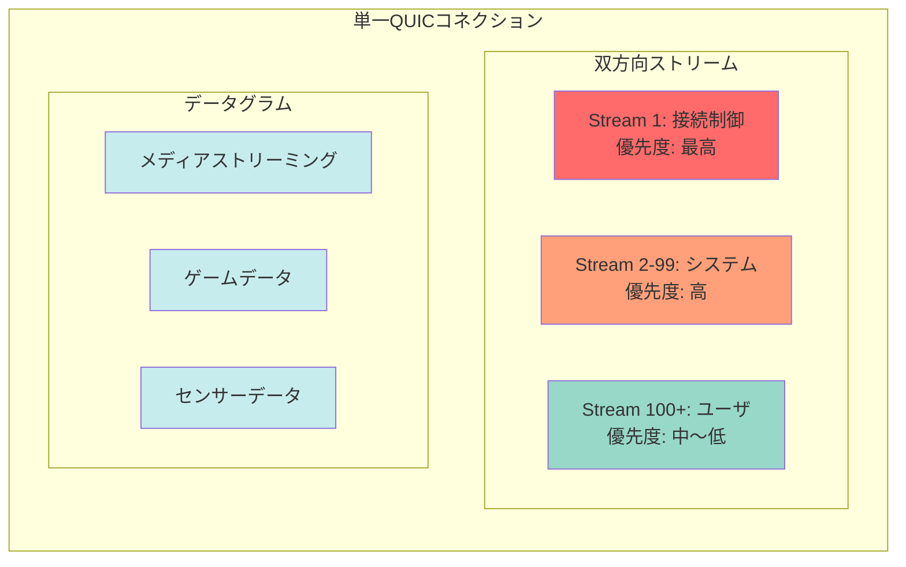
```mermaid
graph LR
    subgraph "単一QUICコネクション"
        direction TB
        
        subgraph "双方向ストリーム"
            S1[Stream 1: 接続制御<br/>優先度: 最高]
            S2[Stream 2-99: システム<br/>優先度: 高]
            S100[Stream 100+: ユーザ<br/>優先度: 中〜低]
        end
        
        subgraph "データグラム"
            D1[メディアストリーミング]
            D2[ゲームデータ]
            D3[センサーデータ]
        end
    end
    
    style S1 fill:#ff6b6b
    style S2 fill:#ffa07a
    style S100 fill:#98d8c8
    style D1 fill:#c7ecee
    style D2 fill:#c7ecee
    style D3 fill:#c7ecee
```

#### 従来技術との比較

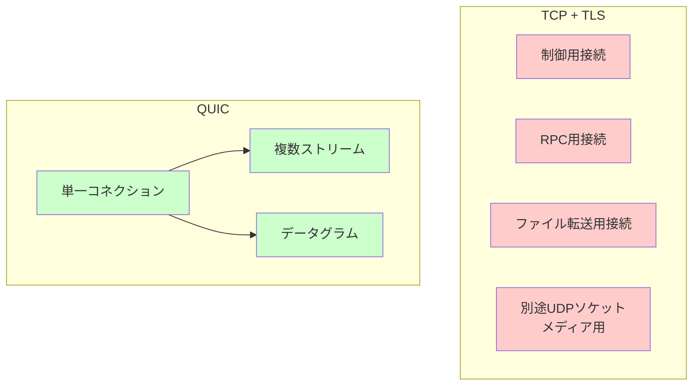
```mermaid
graph TB
    subgraph "TCP + TLS"
        T1[制御用接続]
        T2[RPC用接続]
        T3[ファイル転送用接続]
        T4[別途UDPソケット<br/>メディア用]
    end
    
    subgraph "QUIC"
        Q[単一コネクション]
        Q --> QS[複数ストリーム]
        Q --> QD[データグラム]
    end
    
    style T1 fill:#ffcccc
    style T2 fill:#ffcccc
    style T3 fill:#ffcccc
    style T4 fill:#ffcccc
    style Q fill:#ccffcc
    style QS fill:#ccffcc
    style QD fill:#ccffcc
```

| 技術 | 接続数 | Head-of-Line Blocking | 0-RTT再接続 | 暗号化 |
|------|--------|----------------------|------------|--------|
| TCP + TLS | 複数必要 | あり | なし | 別途実装 |
| WebRTC | 複雑 | 部分的 | なし | あり |
| **QUIC** | **1つ** | **なし** | **あり** | **標準** |

---

## 3. ネットワークアーキテクチャ

### 3.1 3層構造の依存関係

```mermaid
graph TB
    subgraph "Layer 3: Root"
        Root[Root Node<br/>・network_id発行<br/>・グローバル管理]
    end
    
    subgraph "Layer 2: Hub"
        Hub1[Hub 1]
        Hub2[Hub 2]
        Hub3[Hub 3]
    end
    
    subgraph "Layer 1: Agent"
        A1[Agent 1<br/>アプリ実行]
        A2[Agent 2<br/>アプリ実行]
        A3[Agent 3<br/>アプリ実行]
    end
    
    Root -->|network_id発行| Hub1
    Root -->|network_id発行| Hub2
    Root -->|network_id発行| Hub3
    
    Hub1 <-.Hub間通信.-> Hub2
    Hub2 <-.Hub間通信.-> Hub3
    
    Hub1 -->|集約・ルーティング| A1
    Hub2 -->|集約・ルーティング| A2
    Hub3 -->|集約・ルーティング| A3
    
    A1 -.Hub未発見時.->|Hub起動| Hub1
    
    style Root fill:#ff6b6b
    style Hub1 fill:#4ecdc4
    style Hub2 fill:#4ecdc4
    style Hub3 fill:#4ecdc4
    style A1 fill:#95e1d3
    style A2 fill:#95e1d3
    style A3 fill:#95e1d3
```

### 3.2 各ノードの役割

#### Agent（末端ノード）

**役割**: アプリケーション実行環境

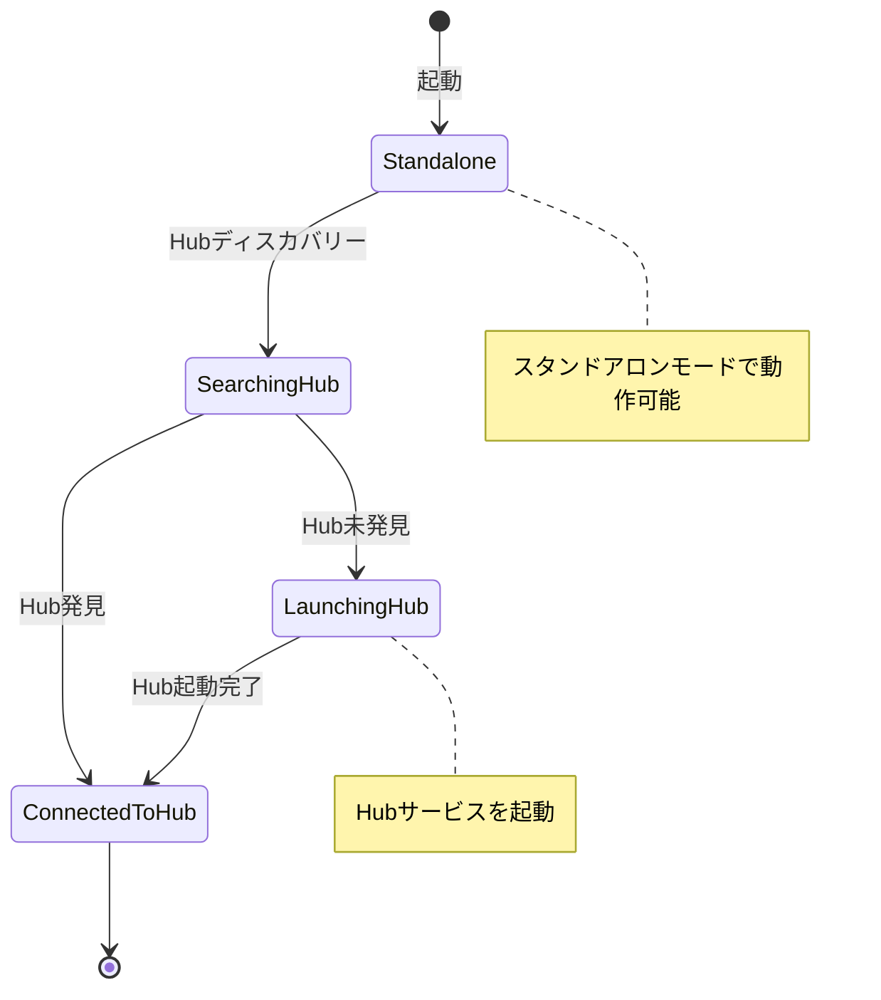
```mermaid
stateDiagram-v2
    [*] --> Standalone: 起動
    Standalone --> SearchingHub: Hubディスカバリー
    SearchingHub --> ConnectedToHub: Hub発見
    SearchingHub --> LaunchingHub: Hub未発見
    LaunchingHub --> ConnectedToHub: Hub起動完了
    ConnectedToHub --> [*]
    
    note right of Standalone
        スタンドアロンモードで動作可能
    end note
    
    note right of LaunchingHub
        Hubサービスを起動
    end note
```

**特徴**:
- Hub無しでも動作可能（スタンドアロンモード）
- 必要に応じてHubに接続

**責務**:
- 起動時にHubを発見・接続
- Hubが見つからない場合、Hub serviceを起動
- アプリケーションロジックの実行

#### Hub（集約・中継ノード）

**役割**: Agentの集約とルーティング

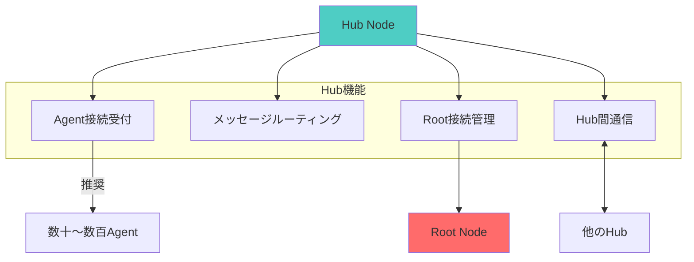
```mermaid
graph TB
    Hub[Hub Node]
    
    subgraph "Hub機能"
        AcceptAgent[Agent接続受付]
        RouteMsg[メッセージルーティング]
        ConnectRoot[Root接続管理]
        MeshHub[Hub間通信]
    end
    
    Hub --> AcceptAgent
    Hub --> RouteMsg
    Hub --> ConnectRoot
    Hub --> MeshHub
    
    AcceptAgent -->|推奨| Agents[数十〜数百Agent]
    ConnectRoot --> Root[Root Node]
    MeshHub <--> OtherHubs[他のHub]
    
    style Hub fill:#4ecdc4
    style Root fill:#ff6b6b
```

**特徴**:
- Hub同士で相互接続（メッシュ）
- 独立したサービスプロセス

**責務**:
- 複数Agentからの接続を管理（推奨: 数十〜数百Agent/Hub）
- Rootへの接続を確立・維持
- メッセージルーティング
- 負荷分散とフェイルオーバー

#### Root（ルートノード）

**役割**: ネットワーク全体の管理・調整

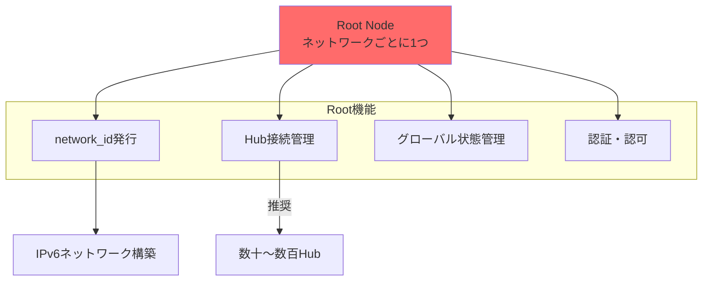
```mermaid
graph TB
    Root[Root Node<br/>ネットワークごとに1つ]
    
    subgraph "Root機能"
        IssueID[network_id発行]
        ManageHub[Hub接続管理]
        GlobalState[グローバル状態管理]
        Auth[認証・認可]
    end
    
    Root --> IssueID
    Root --> ManageHub
    Root --> GlobalState
    Root --> Auth
    
    ManageHub -->|推奨| Hubs[数十〜数百Hub]
    IssueID --> Network[IPv6ネットワーク構築]
    
    style Root fill:#ff6b6b
```

**特徴**:
- ネットワークごとに**常に1つ**
- 複数のHubから接続を受け入れ（推奨: 数十〜数百Hub/Root）

**責務**:
- Hubからの接続を管理
- グローバルな状態管理
- network_idの発行と管理
- 認証・認可（オプション）

### 3.3 スケーラビリティ戦略

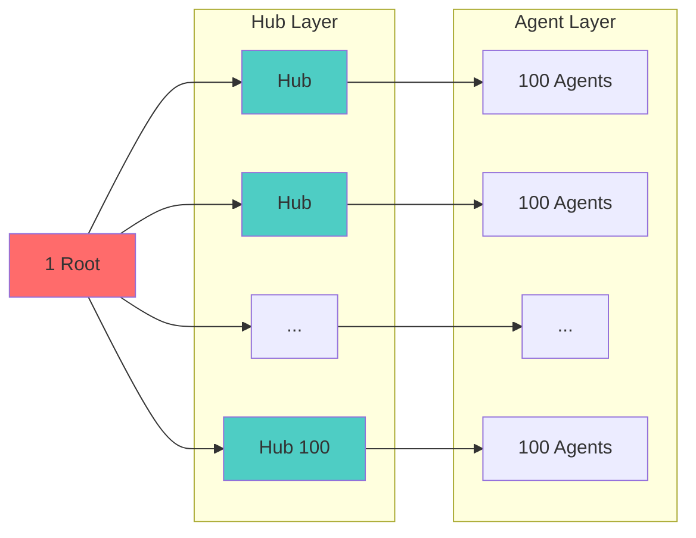
```mermaid
graph LR
    Root[1 Root]
    
    subgraph "Hub Layer"
        H1[Hub]
        H2[Hub]
        H3[...]
        H100[Hub 100]
    end
    
    subgraph "Agent Layer"
        A1[100 Agents]
        A2[100 Agents]
        A3[...]
        A100[100 Agents]
    end
    
    Root --> H1
    Root --> H2
    Root --> H3
    Root --> H100
    
    H1 --> A1
    H2 --> A2
    H3 --> A3
    H100 --> A100
    
    style Root fill:#ff6b6b
    style H1 fill:#4ecdc4
    style H2 fill:#4ecdc4
    style H100 fill:#4ecdc4
```

**階層的スケーリングの例**:

```
1 Root = 100 Hubs (目安)
1 Hub  = 100 Agents (目安)
───────────────────────────
合計   = 10,000 Agents
```

---

## 4. 起動シーケンス

### 4.1 Agentの起動フロー

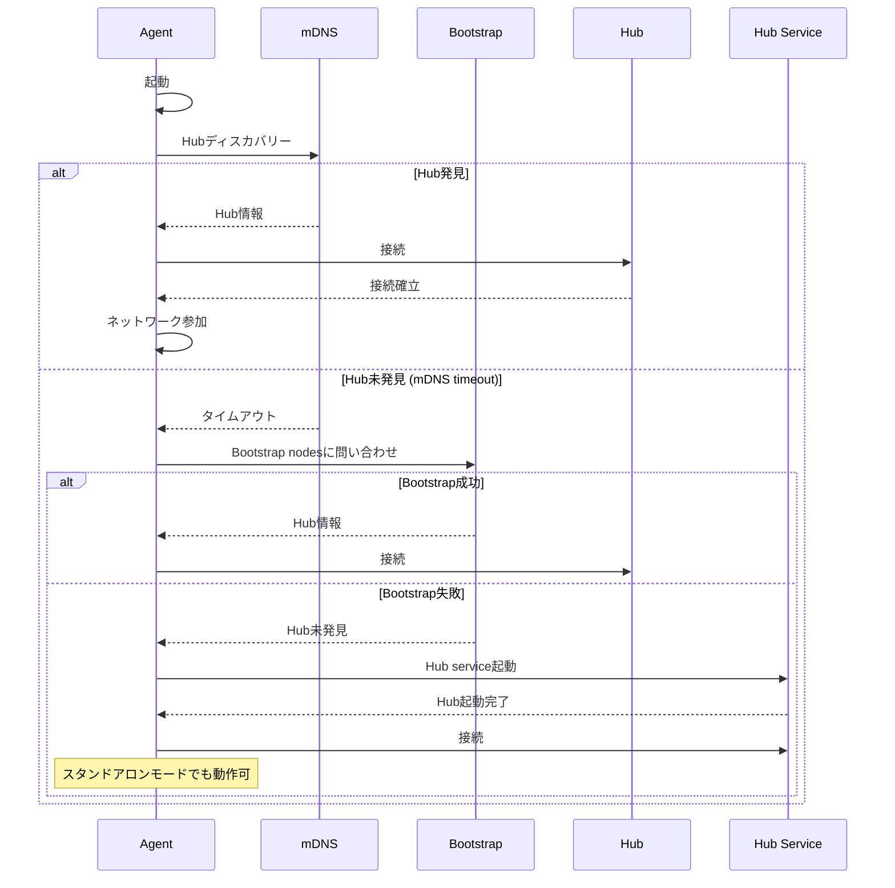
```mermaid
sequenceDiagram
    participant A as Agent
    participant mDNS as mDNS
    participant B as Bootstrap
    participant H as Hub
    participant HS as Hub Service
    
    A->>A: 起動
    A->>mDNS: Hubディスカバリー
    
    alt Hub発見
        mDNS-->>A: Hub情報
        A->>H: 接続
        H-->>A: 接続確立
        A->>A: ネットワーク参加
    else Hub未発見 (mDNS timeout)
        mDNS-->>A: タイムアウト
        A->>B: Bootstrap nodesに問い合わせ
        
        alt Bootstrap成功
            B-->>A: Hub情報
            A->>H: 接続
        else Bootstrap失敗
            B-->>A: Hub未発見
            A->>HS: Hub service起動
            HS-->>A: Hub起動完了
            A->>HS: 接続
            Note over A: スタンドアロンモードでも動作可
        end
    end
```

### 4.2 Hubの起動フロー

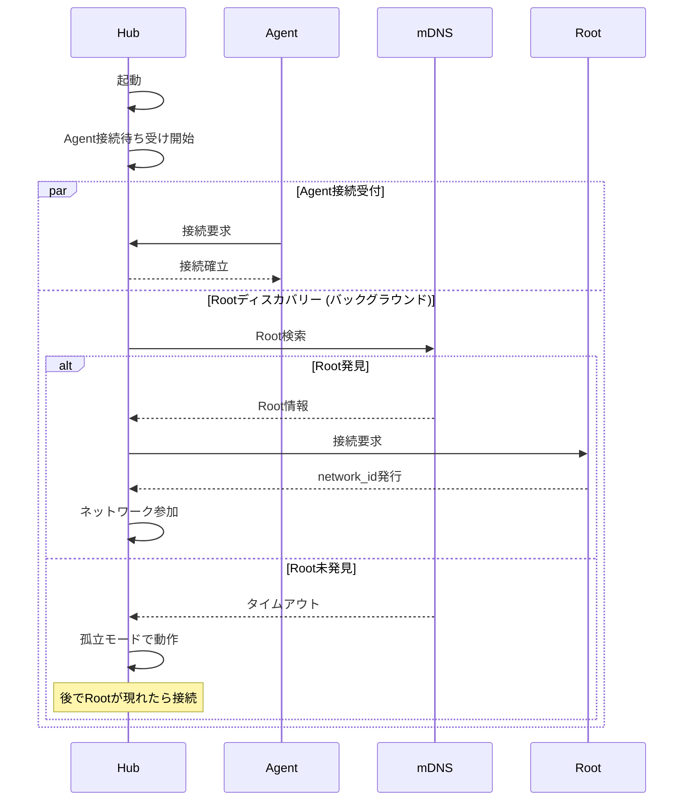
```mermaid
sequenceDiagram
    participant H as Hub
    participant A as Agent
    participant mDNS as mDNS
    participant R as Root
    
    H->>H: 起動
    H->>H: Agent接続待ち受け開始
    
    par Agent接続受付
        A->>H: 接続要求
        H-->>A: 接続確立
    and Rootディスカバリー (バックグラウンド)
        H->>mDNS: Root検索
        
        alt Root発見
            mDNS-->>H: Root情報
            H->>R: 接続要求
            R-->>H: network_id発行
            H->>H: ネットワーク参加
        else Root未発見
            mDNS-->>H: タイムアウト
            H->>H: 孤立モードで動作
            Note over H: 後でRootが現れたら接続
        end
    end
```

### 4.3 Rootの起動フロー

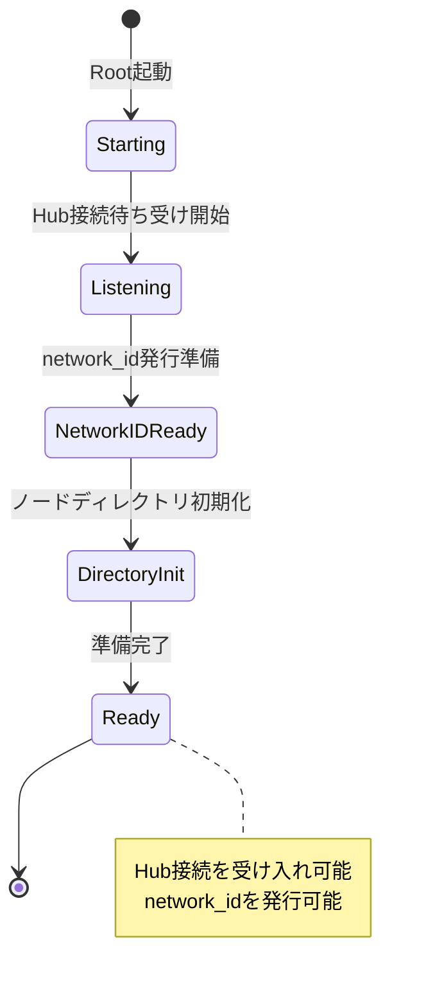
```mermaid
stateDiagram-v2
    [*] --> Starting: Root起動
    Starting --> Listening: Hub接続待ち受け開始
    Listening --> NetworkIDReady: network_id発行準備
    NetworkIDReady --> DirectoryInit: ノードディレクトリ初期化
    DirectoryInit --> Ready: 準備完了
    Ready --> [*]
    
    note right of Ready
        Hub接続を受け入れ可能
        network_idを発行可能
    end note
```

---

## 5. ディスカバリー機構

### 5.1 Hub Discovery（Agentから実行）

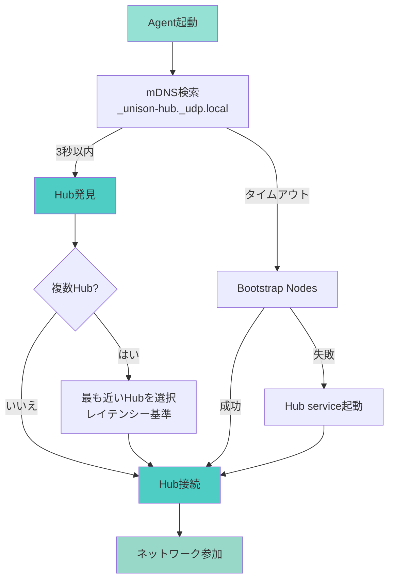
```mermaid
graph TD
    A[Agent起動] --> mDNS[mDNS検索<br/>_unison-hub._udp.local]
    
    mDNS -->|3秒以内| HubFound[Hub発見]
    mDNS -->|タイムアウト| Bootstrap[Bootstrap Nodes]
    
    HubFound --> Select{複数Hub?}
    Select -->|はい| Closest[最も近いHubを選択<br/>レイテンシー基準]
    Select -->|いいえ| Connect[Hub接続]
    Closest --> Connect
    
    Bootstrap -->|成功| Connect
    Bootstrap -->|失敗| Launch[Hub service起動]
    Launch --> Connect
    
    Connect --> Join[ネットワーク参加]
    
    style A fill:#95e1d3
    style HubFound fill:#4ecdc4
    style Connect fill:#4ecdc4
    style Join fill:#98d8c8
```

**優先順位**:

| 順序 | 方式 | 対象 | レイテンシー |
|-----|------|------|------------|
| 1 | mDNS | ローカルネットワーク | < 100ms |
| 2 | Bootstrap Nodes | グローバル | ネットワーク依存 |

### 5.2 Root Discovery（Hubから実行）

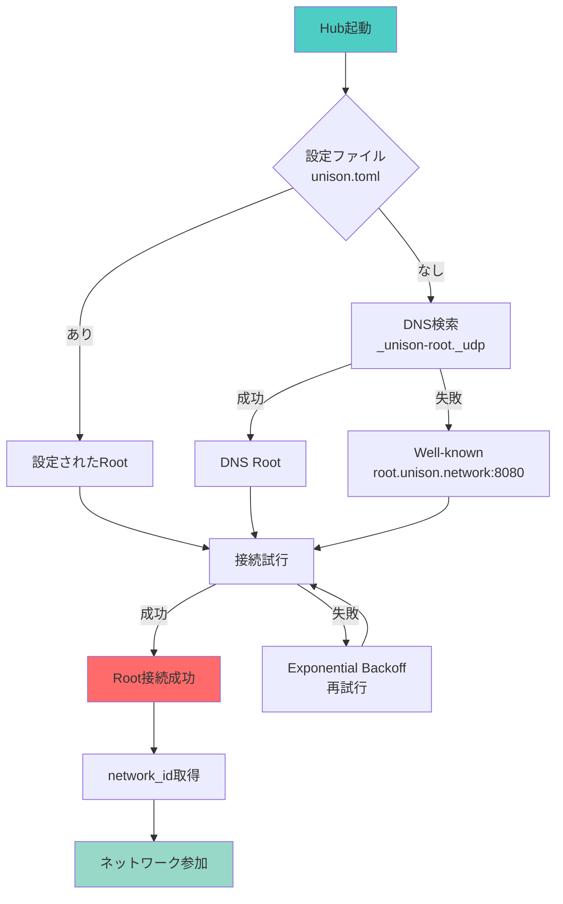
```mermaid
graph TD
    H[Hub起動] --> Config{設定ファイル<br/>unison.toml}
    
    Config -->|あり| ConfigRoot[設定されたRoot]
    Config -->|なし| DNS[DNS検索<br/>_unison-root._udp]
    
    DNS -->|成功| DNSRoot[DNS Root]
    DNS -->|失敗| WellKnown[Well-known<br/>root.unison.network:8080]
    
    ConfigRoot --> TryConnect[接続試行]
    DNSRoot --> TryConnect
    WellKnown --> TryConnect
    
    TryConnect -->|成功| Connected[Root接続成功]
    TryConnect -->|失敗| Retry[Exponential Backoff<br/>再試行]
    
    Retry --> TryConnect
    
    Connected --> GetNetID[network_id取得]
    GetNetID --> Join[ネットワーク参加]
    
    style H fill:#4ecdc4
    style Connected fill:#ff6b6b
    style Join fill:#98d8c8
```

### 5.3 Hub-Hub Discovery

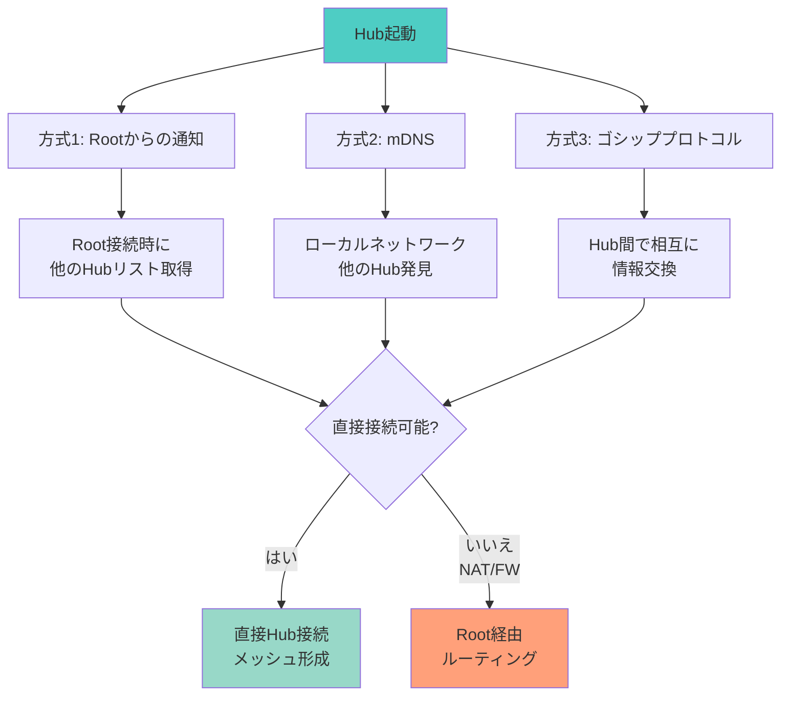
```mermaid
graph TB
    Hub1[Hub起動]
    
    Hub1 --> Method1[方式1: Rootからの通知]
    Hub1 --> Method2[方式2: mDNS]
    Hub1 --> Method3[方式3: ゴシッププロトコル]
    
    Method1 --> Root[Root接続時に<br/>他のHubリスト取得]
    Method2 --> Local[ローカルネットワーク<br/>他のHub発見]
    Method3 --> Gossip[Hub間で相互に<br/>情報交換]
    
    Root --> TryDirect{直接接続可能?}
    Local --> TryDirect
    Gossip --> TryDirect
    
    TryDirect -->|はい| DirectConnect[直接Hub接続<br/>メッシュ形成]
    TryDirect -->|いいえ<br/>NAT/FW| ViaRoot[Root経由<br/>ルーティング]
    
    style Hub1 fill:#4ecdc4
    style DirectConnect fill:#98d8c8
    style ViaRoot fill:#ffa07a
```

---

## 6. Network IDとアドレッシング

### 6.1 Network IDの発行フロー

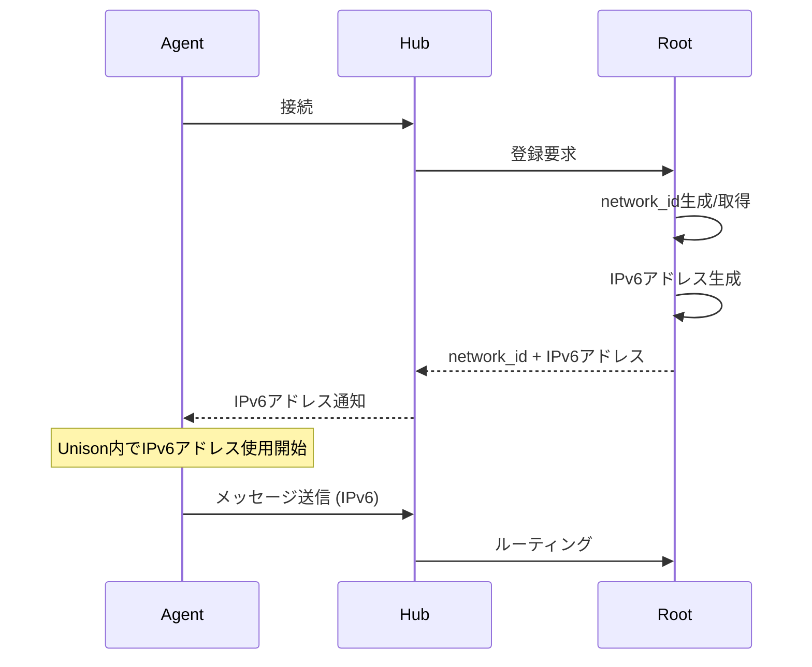
```mermaid
sequenceDiagram
    participant A as Agent
    participant H as Hub
    participant R as Root
    
    A->>H: 接続
    H->>R: 登録要求
    R->>R: network_id生成/取得
    R->>R: IPv6アドレス生成
    R-->>H: network_id + IPv6アドレス
    H-->>A: IPv6アドレス通知
    
    Note over A: Unison内でIPv6アドレス使用開始
    
    A->>H: メッセージ送信 (IPv6)
    H->>R: ルーティング
```

### 6.2 IPv6アドレス構造

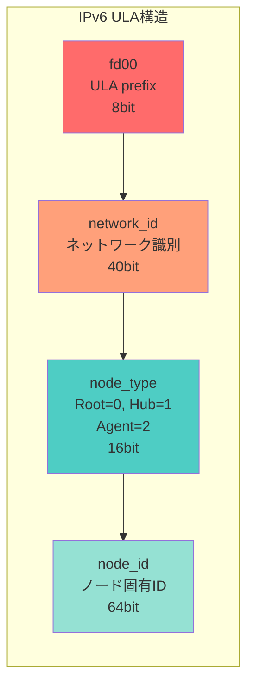
```mermaid
graph LR
    subgraph "IPv6 ULA構造"
        direction TB
        
        FD[fd00<br/>ULA prefix<br/>8bit]
        NID[network_id<br/>ネットワーク識別<br/>40bit]
        NT[node_type<br/>Root=0, Hub=1<br/>Agent=2<br/>16bit]
        NID2[node_id<br/>ノード固有ID<br/>64bit]
        
        FD --> NID
        NID --> NT
        NT --> NID2
    end
    
    style FD fill:#ff6b6b
    style NID fill:#ffa07a
    style NT fill:#4ecdc4
    style NID2 fill:#95e1d3
```

**アドレス例**:

```
Root:  fd00:1234:5678:0000:0000:0000:0000:0001
       └──┘ └────────┘ └──┘ └────────────────┘
        ULA network_id  Root     node_id

Hub:   fd00:1234:5678:0001:0000:0000:0000:0042
       └──┘ └────────┘ └──┘ └────────────────┘
        ULA network_id  Hub      node_id

Agent: fd00:1234:5678:0002:0000:0000:0000:1337
       └──┘ └────────┘ └──┘ └────────────────┘
        ULA network_id  Agent    node_id
```

### 6.3 ネットワーク分離

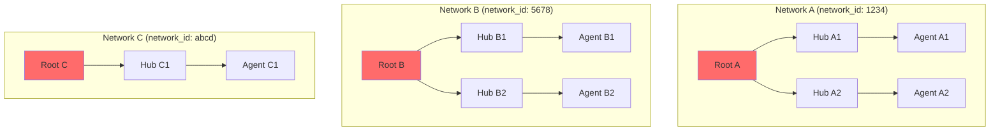
```mermaid
graph TB
    subgraph "Network A (network_id: 1234)"
        RA[Root A]
        HA1[Hub A1]
        HA2[Hub A2]
        AA1[Agent A1]
        AA2[Agent A2]
        
        RA --> HA1
        RA --> HA2
        HA1 --> AA1
        HA2 --> AA2
    end
    
    subgraph "Network B (network_id: 5678)"
        RB[Root B]
        HB1[Hub B1]
        HB2[Hub B2]
        AB1[Agent B1]
        AB2[Agent B2]
        
        RB --> HB1
        RB --> HB2
        HB1 --> AB1
        HB2 --> AB2
    end
    
    subgraph "Network C (network_id: abcd)"
        RC[Root C]
        HC1[Hub C1]
        AC1[Agent C1]
        
        RC --> HC1
        HC1 --> AC1
    end
    
    style RA fill:#ff6b6b
    style RB fill:#ff6b6b
    style RC fill:#ff6b6b
```

**利点**:
- 完全に独立した複数のUnisonネットワークを運用可能
- network_idによる明確な境界
- セキュリティドメインの分離

---

## 7. QUIC通信

### 7.1 QUICコネクションの構造

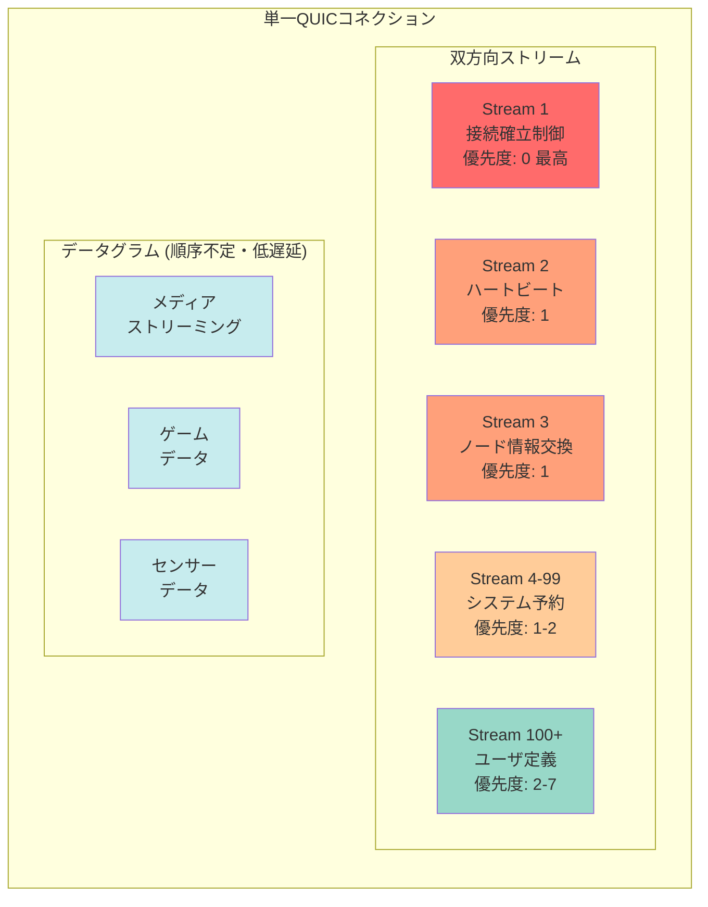
```mermaid
graph TB
    subgraph "単一QUICコネクション"
        direction TB
        
        subgraph "双方向ストリーム"
            S1[Stream 1<br/>接続確立制御<br/>優先度: 0 最高]
            S2[Stream 2<br/>ハートビート<br/>優先度: 1]
            S3[Stream 3<br/>ノード情報交換<br/>優先度: 1]
            S99[Stream 4-99<br/>システム予約<br/>優先度: 1-2]
            S100[Stream 100+<br/>ユーザ定義<br/>優先度: 2-7]
        end
        
        subgraph "データグラム (順序不定・低遅延)"
            D1[メディア<br/>ストリーミング]
            D2[ゲーム<br/>データ]
            D3[センサー<br/>データ]
        end
    end
    
    style S1 fill:#ff6b6b
    style S2 fill:#ffa07a
    style S3 fill:#ffa07a
    style S99 fill:#ffcc99
    style S100 fill:#98d8c8
    style D1 fill:#c7ecee
    style D2 fill:#c7ecee
    style D3 fill:#c7ecee
```

### 7.2 Stream 1: 接続確立制御

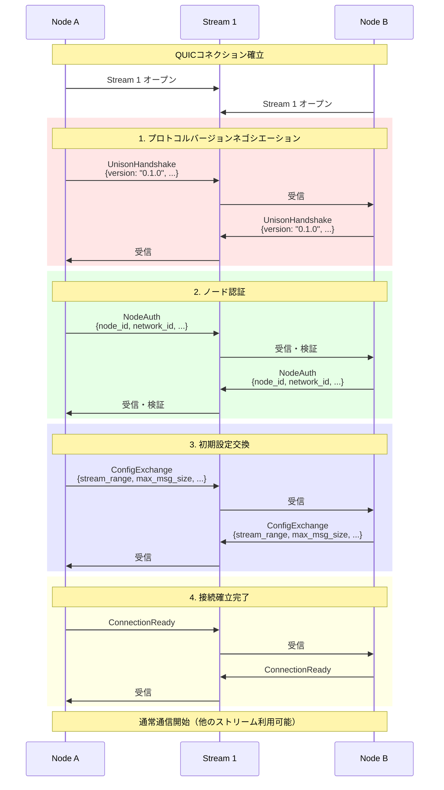
```mermaid
sequenceDiagram
    participant A as Node A
    participant S1 as Stream 1
    participant B as Node B
    
    Note over A,B: QUICコネクション確立
    
    A->>S1: Stream 1 オープン
    B->>S1: Stream 1 オープン
    
    rect rgb(255, 230, 230)
    Note over A,B: 1. プロトコルバージョンネゴシエーション
    A->>S1: UnisonHandshake<br/>{version: "0.1.0", ...}
    S1->>B: 受信
    B->>S1: UnisonHandshake<br/>{version: "0.1.0", ...}
    S1->>A: 受信
    end
    
    rect rgb(230, 255, 230)
    Note over A,B: 2. ノード認証
    A->>S1: NodeAuth<br/>{node_id, network_id, ...}
    S1->>B: 受信・検証
    B->>S1: NodeAuth<br/>{node_id, network_id, ...}
    S1->>A: 受信・検証
    end
    
    rect rgb(230, 230, 255)
    Note over A,B: 3. 初期設定交換
    A->>S1: ConfigExchange<br/>{stream_range, max_msg_size, ...}
    S1->>B: 受信
    B->>S1: ConfigExchange<br/>{stream_range, max_msg_size, ...}
    S1->>A: 受信
    end
    
    rect rgb(255, 255, 230)
    Note over A,B: 4. 接続確立完了
    A->>S1: ConnectionReady
    S1->>B: 受信
    B->>S1: ConnectionReady
    S1->>A: 受信
    end
    
    Note over A,B: 通常通信開始（他のストリーム利用可能）
```

### 7.3 ストリーム予約マップ

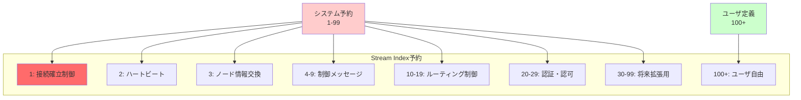
```mermaid
graph TB
    subgraph "Stream Index予約"
        S1[1: 接続確立制御]
        S2[2: ハートビート]
        S3[3: ノード情報交換]
        S4_9[4-9: 制御メッセージ]
        S10_19[10-19: ルーティング制御]
        S20_29[20-29: 認証・認可]
        S30_99[30-99: 将来拡張用]
        S100[100+: ユーザ自由]
    end
    
    System[システム予約<br/>1-99] --> S1
    System --> S2
    System --> S3
    System --> S4_9
    System --> S10_19
    System --> S20_29
    System --> S30_99
    
    User[ユーザ定義<br/>100+] --> S100
    
    style System fill:#ffcccc
    style User fill:#ccffcc
    style S1 fill:#ff6b6b
```

### 7.4 ストリームとデータグラムの使い分け

```mermaid
graph TD
    Start{通信要件}
    
    Start -->|順序保証必須| Stream
    Start -->|低遅延優先| Datagram
    
    Stream{信頼性}
    Stream -->|必須| BidiStream[双方向ストリーム]
    
    BidiStream{用途}
    BidiStream -->|システム| SysStream[Stream 1-99<br/>制御・認証]
    BidiStream -->|アプリ| UserStream[Stream 100+<br/>RPC・ファイル転送]
    
    Datagram{データ特性}
    Datagram -->|メディア| Media[メディアストリーム<br/>音声・動画]
    Datagram -->|リアルタイム| RT[ゲーム・センサー]
    Datagram -->|ベストエフォート| BE[ログ配信]
    
    style Stream fill:#98d8c8
    style Datagram fill:#c7ecee
    style SysStream fill:#ffa07a
    style UserStream fill:#95e1d3
```

---

## 8. パケットフォーマット

### 8.1 UnisonPacket構造

```mermaid
graph TB
    subgraph "UnisonPacket"
        direction TB
        
        Header[PacketHeader<br/>64 bytes固定長]
        Payload[Payload<br/>可変長]
        
        subgraph "Header詳細"
            V[version: u8]
            PT[packet_type: u8]
            F[flags: u16]
            PL[payload_length: u32]
            CL[compressed_length: u32]
            SN[sequence_number: u64]
            TS[timestamp: u64]
            SID[stream_id: u64]
            MID[message_id: u64]
            RT[response_to: u64]
        end
        
        Header --> V
        Header --> PT
        Header --> F
        Header --> PL
        Header --> CL
        Header --> SN
        Header --> TS
        Header --> SID
        Header --> MID
        Header --> RT
        
        Header -.-> Payload
    end
    
    style Header fill:#ffcccc
    style Payload fill:#ccffcc
```

### 8.2 メッセージタイプ識別

```mermaid
graph TD
    Packet[UnisonPacket]
    
    Packet --> CheckMID{message_id}
    Packet --> CheckRT{response_to}
    
    CheckMID -->|= 0| MID0[message_id = 0]
    CheckMID -->|> 0| MID1[message_id > 0]
    
    CheckRT -->|= 0| RT0[response_to = 0]
    CheckRT -->|> 0| RT1[response_to > 0]
    
    MID0 & RT0 --> Oneway[Oneway<br/>一方向メッセージ]
    MID1 & RT0 --> Request[Request<br/>リクエスト]
    MID1 & RT1 --> Response[Response<br/>レスポンス]
    
    Request -.message_id: 123.-> Response
    Response -.response_to: 123.-> Request
    
    style Oneway fill:#c7ecee
    style Request fill:#98d8c8
    style Response fill:#95e1d3
```

**識別ルール**:

```mermaid
flowchart LR
    Start([パケット受信])
    
    Start --> CheckMID{message_id<br/>== 0?}
    
    CheckMID -->|はい| CheckRT1{response_to<br/>== 0?}
    CheckMID -->|いいえ| CheckRT2{response_to<br/>== 0?}
    
    CheckRT1 -->|はい| Oneway[Oneway]
    CheckRT1 -->|いいえ| Invalid1[無効]
    
    CheckRT2 -->|はい| Request[Request]
    CheckRT2 -->|いいえ| Response[Response]
    
    style Oneway fill:#c7ecee
    style Request fill:#98d8c8
    style Response fill:#95e1d3
    style Invalid1 fill:#ffcccc
```

### 8.3 Request-Response相関

```mermaid
sequenceDiagram
    participant C as Client
    participant S as Server
    
    Note over C: message_id生成: 42
    
    C->>S: Request<br/>message_id: 42<br/>response_to: 0<br/>payload: "getUserInfo"
    
    Note over S: リクエスト処理
    Note over S: message_id生成: 99
    Note over S: response_toに42を設定
    
    S->>C: Response<br/>message_id: 99<br/>response_to: 42<br/>payload: {user: ...}
    
    Note over C: response_to == 42<br/>→ 元のリクエストに対応
```

### 8.4 圧縮フロー

```mermaid
flowchart TD
    Start[ペイロード]
    
    Start --> CheckSize{payload_length<br/>>= 2KB?}
    
    CheckSize -->|いいえ| NoCompress[非圧縮のまま送信<br/>compressed_length = 0]
    CheckSize -->|はい| Compress[zstd Level 1で圧縮]
    
    Compress --> CheckEffect{compressed_length<br/>< payload_length?}
    
    CheckEffect -->|はい| UseCompressed[圧縮版を送信<br/>compressed_length > 0<br/>flagsにCOMPRESSEDセット]
    CheckEffect -->|いいえ| NoCompress
    
    NoCompress --> Send[送信]
    UseCompressed --> Send
    
    style NoCompress fill:#c7ecee
    style UseCompressed fill:#98d8c8
```

---

## 9. 障害時の動作

### 9.1 Hub障害時のフローチャート

```mermaid
flowchart TD
    AgentConnected[Agent - Hub接続中]
    
    AgentConnected --> HubFail[Hub障害発生]
    
    HubFail --> Detect[接続断を検知]
    
    Detect --> Rediscover[Hubディスカバリー再実行]
    
    Rediscover --> Found{他のHub発見?}
    
    Found -->|はい| Reconnect[他のHubに再接続]
    Found -->|いいえ| LaunchNew[新しいHub起動]
    
    Reconnect --> Recovered[接続復旧]
    LaunchNew --> Reconnect
    
    Recovered --> Normal[通常動作再開]
    
    style HubFail fill:#ffcccc
    style Recovered fill:#ccffcc
```

### 9.2 Root障害時の影響範囲

```mermaid
graph TB
    Root[Root障害発生]
    
    Root --> Impact1[既存Hub接続: 切断]
    Root --> Impact2[新規Agent: 参加不可]
    Root --> Impact3[network_id発行: 停止]
    
    Impact1 --> Hub1[Hub → 孤立モード]
    Hub1 --> Keep[既存Agent接続: 維持]
    Hub1 --> Mesh[Hub間メッシュ: 維持]
    
    Hub1 --> Retry[Root再接続を定期試行<br/>Exponential Backoff]
    
    Retry --> RootRecover{Root復旧?}
    
    RootRecover -->|はい| Reconnect[自動再接続]
    RootRecover -->|いいえ| Retry
    
    Reconnect --> Resync[状態再同期]
    Resync --> Normal[通常動作再開]
    
    style Root fill:#ff6b6b
    style Hub1 fill:#ffa07a
    style Normal fill:#ccffcc
```

### 9.3 障害時の動作まとめ

```mermaid
graph LR
    subgraph "Agent障害"
        A1[影響範囲: 最小]
        A2[Hub: リソースクリーンアップ]
        A3[他ノード: 影響なし]
    end
    
    subgraph "Hub障害"
        H1[影響範囲: 中]
        H2[Agent: 他Hubに再接続]
        H3[Root: 障害報告受信]
    end
    
    subgraph "Root障害"
        R1[影響範囲: 大]
        R2[Hub: 孤立モード移行]
        R3[既存通信: 継続可能]
        R4[新規参加: 不可]
    end
    
    style A1 fill:#ccffcc
    style H1 fill:#ffffcc
    style R1 fill:#ffcccc
```

---

## 10. セキュリティ

### 10.1 セキュリティレイヤー

```mermaid
graph TB
    subgraph "セキュリティ階層"
        direction TB
        
        L1[アプリケーション層<br/>認証・認可]
        L2[ネットワーク層<br/>Network ID検証]
        L3[トランスポート層<br/>QUIC/TLS 1.3]
        
        L1 --> L2
        L2 --> L3
    end
    
    L1 --> Auth[Root認証<br/>アクセス制御]
    L2 --> NetID[Network ID検証<br/>不正ネットワーク拒否]
    L3 --> TLS[暗号化<br/>前方秘匿性<br/>証明書検証]
    
    style L1 fill:#ff6b6b
    style L2 fill:#ffa07a
    style L3 fill:#ffcc99
```

### 10.2 認証フロー

```mermaid
sequenceDiagram
    participant A as Agent
    participant H as Hub
    participant R as Root
    
    A->>H: 接続要求
    H->>H: TLS 1.3ハンドシェイク
    H-->>A: 暗号化確立
    
    A->>H: ノード情報<br/>(node_id, 証明書)
    H->>H: 証明書検証
    
    alt 検証成功
        H->>R: Agent登録要求<br/>(node_id, network_id)
        R->>R: Network ID検証
        R->>R: 認証・認可チェック
        
        alt 認証成功
            R-->>H: network_id + IPv6アドレス
            H-->>A: 接続確立完了
        else 認証失敗
            R-->>H: 認証エラー
            H-->>A: 接続拒否
        end
    else 検証失敗
        H-->>A: 証明書エラー
    end
```

---

## 11. 今後の拡張

### 11.1 拡張ロードマップ

```mermaid
timeline
    title Unison Network 拡張計画
    
    section 短期 (v0.2-0.3)
        NAT traversal実装
        : ホールパンチング
        : STUN/TURNサポート
        
        Root冗長化
        : Hot Standby
        : 自動フェイルオーバー
        
        DHT Discovery
        : 分散ディスカバリー
        : スケーラビリティ向上
    
    section 中期 (v0.4-0.6)
        マルチリージョンRoot
        : 地理的分散
        : レイテンシー最適化
        
        エッジコンピューティング
        : エッジノード対応
        : 計算オフロード
    
    section 長期 (v1.0+)
        P2P最適化
        : Hubバイパス
        : 直接通信
        
        カスタムルーティング
        : ポリシーベース
        : QoS制御
```

### 11.2 機能依存関係

```mermaid
graph TB
    subgraph "v0.1 (Current)"
        Core[コアネットワーク]
        QUIC[QUIC通信]
        Discovery[基本ディスカバリー]
    end
    
    subgraph "v0.2-0.3"
        NAT[NAT Traversal]
        RootHA[Root冗長化]
        DHT[DHT Discovery]
    end
    
    subgraph "v0.4-0.6"
        MultiRegion[マルチリージョンRoot]
        Edge[エッジコンピューティング]
    end
    
    subgraph "v1.0+"
        P2P[P2P最適化]
        CustomRoute[カスタムルーティング]
    end
    
    Core --> NAT
    Core --> RootHA
    Discovery --> DHT
    
    RootHA --> MultiRegion
    NAT --> P2P
    DHT --> Edge
    
    MultiRegion --> CustomRoute
    Edge --> CustomRoute
    P2P --> CustomRoute
    
    style Core fill:#ccffcc
    style NAT fill:#ffffcc
    style MultiRegion fill:#ffeecc
    style P2P fill:#ffddcc
```

---

## 12. 関連ドキュメント

### 12.1 ドキュメント構造

```mermaid
graph LR
    subgraph "仕様書 (spec/)"
        Spec01[01: コアネットワーク]
        Spec02[02: RPCプロトコル]
    end
    
    subgraph "設計 (design/)"
        DesignArch[architecture.md]
        DesignPacket[packet.md]
    end
    
    subgraph "ガイド (guides/)"
        GuideQuinn[quinn-stream-api.md]
    end
    
    subgraph "実装 (crates/)"
        ImplProtocol[unison-protocol]
        ImplNetwork[unison-network]
    end
    
    Spec01 -.参照.-> Spec02
    Spec01 --> DesignArch
    Spec01 --> DesignPacket
    DesignArch --> GuideQuinn
    DesignPacket --> ImplProtocol
    GuideQuinn --> ImplNetwork
    
    style Spec01 fill:#ffcccc
    style Spec02 fill:#ffcccc
    style DesignArch fill:#ccffcc
    style DesignPacket fill:#ccffcc
    style GuideQuinn fill:#ccccff
    style ImplProtocol fill:#ffeecc
    style ImplNetwork fill:#ffeecc
```

### 仕様書
- [spec/02: RPCプロトコル](../02-protocol-rpc/SPEC.md) - KDLベースRPC層

### 設計ドキュメント
- [アーキテクチャ設計](../../design/architecture.md) - 全体アーキテクチャの実装詳細
- [パケット実装仕様](../../design/packet.md) - UnisonPacket実装詳細

### 実装ガイド
- [Quinn APIガイド](../../guides/quinn-stream-api.md) - QUIC実装の使い方

### 実装
- [unison-protocol実装](../../crates/unison-protocol/) - パケット実装
- [unison-network実装](../../crates/unison-network/) - ネットワーク層実装

---

**仕様バージョン**: 0.1.0-draft  
**最終更新**: 2025-11-05  
**ステータス**: Draft
